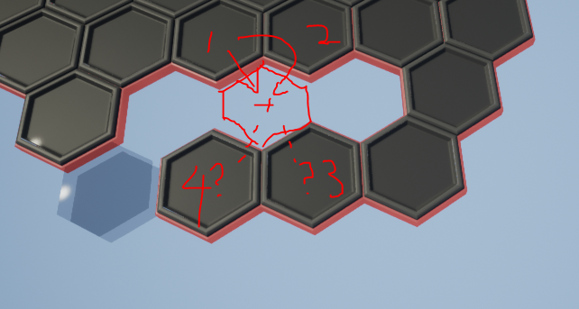

# Design Retro

## Overview

* 这个文档用来记录一些值得反思的设计思路。

### playground level design

* World Outliner:
    * 一个棋盘generator，可以让用户定义目标棋盘
        * 实际该如何定义？
            * 方案A：制作一个level专门用来定义和编辑地图，输出结果是一份最终地图效果数据并且可以被读取和复原，以及二次编辑。问题在于，编辑修改成本比较高。
            * 方案B(最好有这个): 直接在编辑器里定义和编译。但不知道编辑器里面支持多少操作，允不允许。
    * 一个token player，用户可以通过它看到各种算法效果：
        * 包括连通性验证
        * 邻居关系验证

### Editor中最好支持的功能
* Spawn 六边形棋盘
* Spawn 平行四边形棋盘
* 编辑现有棋盘：
    * invalidate 一个棋格，删除它的邻居关系
    * 选中一个棋格，并根据给定方向添加棋格，为新的棋格添加邻居关系
    * 选择多个棋格子（可能连通也可能不连通），删除它们的邻居关系
    * 选择多个棋格子（可能连通也可能不连通），在边缘部分延需要方向增加一层

* 考虑到以下这种情况，连通关系就会出现bug:
    * 棋格子1，2，3，4是已有的棋格
    * 红色那个是企图新增的棋格，是由棋格子1添加的
    * 棋格子1，2 的联通关系可以比较快速简单计算出来，但是棋格子3，4的联通关系就不好计算了。
    
    