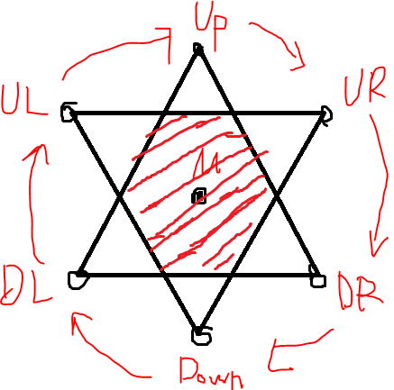

# Flip project 技术回顾

## 设计回顾

* 棋子的索引
* 计算棋子方向关系
* 搜索棋子邻居

## 功能区域：

* 负责计算和生成六边形的几何关系，如邻居关系和位置关系
    * 应当支持在editor里面生成六边形的嵌套关系位置
    * 应当提供各种棋盘形状的生成函数，且支持在editor里生成
    * 应当支持六边形棋盘的自编辑，如增加，删除，以及无效化
        * 要提供save函数，每次editor里进行编辑后，当按下save就会刷新棋子队列，并进行保存。
        * 要提供neighbor info函数，每当有neighbor关系发生变化，要及时更新每个棋子的邻居关系。
* 负责提供global咨询接口
* 负责存储维护生成的棋子
    * 所有cell的实际instance都存储在这个地方
    * invalidate的棋子


## 属性：

* 每个六边形cell的属性： 
    * HexCell radius: 每个六边形半径，决定六边形的半径是多少

* TotalCells：限定生成六边形的数量


## 改进：六边形上的方向 HexegonDirection

* 六边形上基于方向的操作出乎意料地多，这一点是这次没有想到的，所以多了很多繁琐的操作。
* 应该考虑一套基于方向的，简单快捷的数据结构。
* 建议：
    * 新增一个方向相关的数据结构，提供+和-操作
    * 对于单个六边形，应当支持通过使用dir来做索引，以返回邻居六边形

```cpp
//比较
auto dirA = Up;
auto dirB = Down;
auto dirC = Up;

assert(dirA!=dirB);
assert(dirA == dirC);

//标量加减
auto dirA = dirB + 3; //dirB 顺时针3步
auto dirC = dirD - 3; //dirC 逆时针3步
auto dirB = dirA - 3; //dirA 逆时针三步

//约束
auto dirB = Up;
auto dirA = dirB + 6;
auto dirA = dirB + 6*n; (n:u32 > 0 )
assert(dirB == dirA);

//用dir作为索引
Hexegon hex;
Hexegon nei_1 = hex.Neighbor(dirA);
Hexegon nei_2 = hex.Nieghbor(dirB);

//禁止direction和direction之间相加减
auto dirA = Up;
auto dirB = UL;
dirA + dirB --> compile error
```

## 改进

## 六边形棋盘生成算法

### 反思实现思路

* 活用AttachToComponent
* 原点要定位好位置，第一个棋子应该放在(0,0,0)

### 基本绘制方法
六边形棋盘中，六边形和六边形之间的位置关系，要保证尽量嵌套并在一起。这里使用了一个比较直观的方法来绘制六边形棋盘：把两个正三角形上下重合，中间相交的图案就是正六边形，而突出来的六个点则正好就是几个邻居六边形的中点的位置。接下来，只需要通过简单的广度优先搜索，就可以生成相互交错嵌套的六边形棋盘，且邻居关系也可以明确。



### 实现要点

* 等边三角形的表示
    * 只需要中点，底边A和底边B，就可以计算出上下两个等边三角形的六个顶点。

* 邻居方向关系（可改进）:
    * 目前是需要通过排序来生成各个顶点。虽然速度也是O(1)，但是果然还是，理论上通过中点和底边顶点关系，是可以直接计算
    归纳出邻居点和当前点的位置关系的。
    * 每当新增一个棋子的时候，父棋子需要为子棋子增加连通关系。连通关系可以通过顺时针（或者逆时针）访问来设置。虽然也想尝试一次性两个方向都配合，但是感觉比较麻烦时间不够就没做了。

* 代码：```AHexCellGrid::GenerateHexCellGrid``` 和 ```AHexCellGrid::GenerateChessGrid``` in `HexCellGrid.cpp`
    * 其中，```GenerateHexCellGrid```是围绕起点环绕生成大六边形棋盘
    * ```GenerateHexCellGrid```是围绕起点环绕生成平行四边形棋盘


